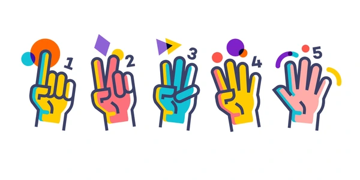
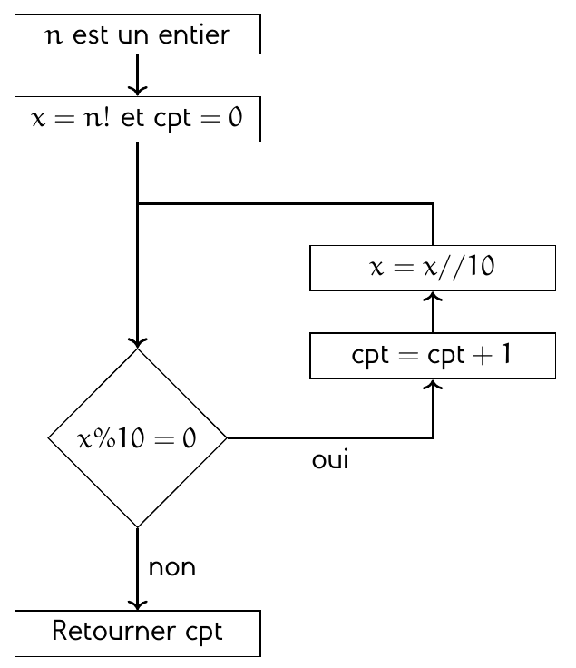
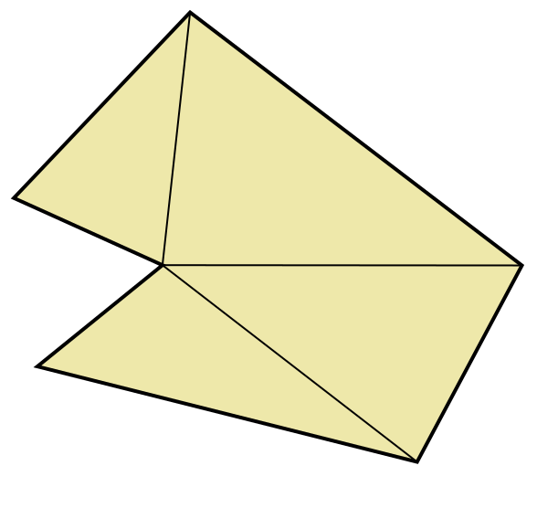

# Dénombrer en informatique

Dénombrer des éléments a toujours été une nécessité pour les êtres humains. Des premiers échanges commerciaux jusqu'à aujourd'hui, dénombrer rapidement a souvent été un thème central du questionnement mathématique.

On s'intéresse dans ce TP à différents problèmes de dénombrement.

<center>
    
</center>

## La factorielle

La factorielle d'un entier naturel $n$ correspond au produit de tous les entiers compris entre $1$ et $n$. Il est noté $n!$.  

Par exemple, on a :

$$
4! = 1\times 2\times 3\times 4 = 24
$$

Il est facile de programmer en Python une fonction qui renvoie la factorielle d'un entier $n$ mais il est également possible de récupérer une telle
fonction depuis le module **math**.

Ouvrez le logiciel **Thonny** et créez un nouveau script avec le code :

``` python title="Factorielle" linenums="1"
from math import factorial   
```

1. Vérifiez dans la console que $4! = 24$ et que $5! = 120$.
2. Testez l'instruction `[factorial(k) for k in range(15)]` qui calcule les factorielles des entiers de $0$ à $14$.
3. Un problème classique en mathématiques est de déterminer le nombre de $0$ qui sont situés à la fin d'une factorielle.  
  Par exemple, $5!$ se termine par un seul $0$ alors que $10!$ se termine avec deux $0$.  
  Pour programmer une fonction qui détermine le nombre de zéros à la fin d'une factorielle, on peut utiliser l'algorigramme :
  <center>
      
  </center>
  L'instruction `x % 10` permet de récupérer le chiffre des unités alors que `x // 10` le supprime du nombre `x`.  
  Complétez le code ci-dessous pour qu'il respecte l'algorigramme précédent :
  ``` python title="Factorielle" linenums="1"
  from math import factorial   

  def zeros(n:int) -> int:
    '''
      Retourne le nombre de 0 à la fin de n!
    '''
    x   = factorial(n)
    cpt = 0

    while ... :

        cpt = ...
        x   = ...

    return cpt
  ```

2. Vérifiez que $2025!$ possède $505$ zéros finaux.

## Deviner n'est pas compter !

Il se peut parfois que l'intuition mette en défaut un résultat. 

<center>
  
</center>

On s'intéresse à un cercle donné et on y place des points sur sa frontière. En reliant ces points par des lignes droites, le cercle initial est découpé en régions.  

Lorsqu'on place un point sur le cercle, on ne définit qu'une seule région ;  
Lorsqu'on place deux points, on définit deux régions, etc.

La question porte sur l'évolution de cette suite.

1. En plaçant des points sur le cercle ci-dessous, observez comment le nombre de régions évolue jusque $n=5$ points.  
Placez alors un sixième point.

<div class="map1">

<style>
  #wrap { text-align:center; display:flex; flex-direction: column; align-items: center;}
  canvas { background: white; border-radius:12px; box-shadow:0 6px 20px rgba(10,10,30,0.08); cursor:pointer; display:block; }
  #controls { margin:12px 0; font-family:system-ui,Segoe UI,Roboto,"Helvetica Neue",Arial; }
  button { margin-left:8px; padding:6px 10px; border-radius:6px; border:1px solid #ccc; background:white; cursor:pointer; }
  #info { margin-top:8px; font-size:14px; color:#333; }
</style>
</head>
<body>
<div id="wrap">
  <canvas id="c" width="500" height="500"></canvas>
  <div id="controls">
    <button id="clearBtn">Effacer</button>
  </div>
</div>

<script>
const Ex1canvas = document.getElementById('c');
const Ex1ctx = Ex1canvas.getContext('2d');
const center = { x: Ex1canvas.width/2, y: Ex1canvas.height/2 };
const radius = Math.min(Ex1canvas.width, Ex1canvas.height)/2 - 30;

let points = [];
let chords = [];
let regionData = []; // {id,color,center,selected}
let lastRegionMap = null;

const clearBtn = document.getElementById('clearBtn');
const statsEl = document.getElementById('stats');
const selCountEl = document.getElementById('selCount');

/* Pastel random */
function pastelColor(alpha=0.7){
  const r = Math.floor((Math.random()*127)+127);
  const g = Math.floor((Math.random()*127)+127);
  const b = Math.floor((Math.random()*127)+127);
  return `rgba(${r},${g},${b},${alpha})`;
}

/* Segment intersection */
function segIntersects(a,b,c,d){
  const r = { x: b.x - a.x, y: b.y - a.y };
  const s = { x: d.x - c.x, y: d.y - c.y };
  const denom = r.x * s.y - r.y * s.x;
  if (Math.abs(denom) < 1e-9) return false;
  const t = ((c.x - a.x) * s.y - (c.y - a.y) * s.x) / denom;
  const u = ((c.x - a.x) * r.y - (c.y - a.y) * r.x) / denom;
  return (t >= 0 && t <= 1 && u >= 0 && u <= 1);
}

/* Build all chords */
function buildChords(){
  chords.length = 0;
  for (let i=0;i<points.length;i++){
    for (let j=i+1;j<points.length;j++){
      chords.push({a: points[i], b: points[j]});
    }
  }
}

/* Compute regions */
function computeRegions(gridN=420){
  const cellSize = (2*radius)/gridN;
  const offX = center.x - radius;
  const offY = center.y - radius;

  function cellCenter(i,j){
    return { x: offX + (i + 0.5)*cellSize, y: offY + (j + 0.5)*cellSize };
  }

  const inside = new Uint8Array(gridN*gridN);
  for (let j=0;j<gridN;j++){
    for (let i=0;i<gridN;i++){
      const p = cellCenter(i,j);
      inside[j*gridN+i] = Math.hypot(p.x-center.x,p.y-center.y) <= radius - (cellSize*0.7) ? 1:0;
    }
  }

  const regionId = new Int32Array(gridN*gridN);
  regionId.fill(-1);

  const neighbors = [[1,0],[-1,0],[0,1],[0,-1]];

  function crossesAnyChord(p1,p2){
    for (const ch of chords){
      if (segIntersects(p1,p2,ch.a,ch.b)) return true;
    }
    return false;
  }

  let nextId = 0;
  regionData = [];

  for (let j=0;j<gridN;j++){
    for (let i=0;i<gridN;i++){
      const idx = j*gridN + i;
      if (!inside[idx] || regionId[idx] !== -1) continue;

      const color = pastelColor(0.65);
      const q = [idx];
      regionId[idx] = nextId;
      let cells = [];

      while(q.length){
        const cur = q.pop();
        const cx = cur % gridN, cy = Math.floor(cur / gridN);
        const pc = cellCenter(cx,cy);
        cells.push(pc);

        for(const d of neighbors){
          const nx=cx+d[0], ny=cy+d[1];
          if(nx<0||nx>=gridN||ny<0||ny>=gridN) continue;
          const nidx = ny*gridN+nx;
          if(!inside[nidx]||regionId[nidx]!==-1) continue;
          const p2 = cellCenter(nx,ny);
          if(!crossesAnyChord(pc,p2)){
            regionId[nidx] = nextId;
            q.push(nidx);
          }
        }
      }

      // barycentre
      let bx=0,by=0;
      for(const p of cells){ bx+=p.x; by+=p.y; }
      bx/=cells.length; by/=cells.length;
      regionData.push({id: nextId, color, center: {x:bx,y:by}, selected:false});
      nextId++;
    }
  }

  lastRegionMap = {regionId,gridN,cellSize,offX,offY};
  return {regionId,gridN,cellSize,offX,offY};
}

/* Formule A000127 */
function choose(n,k){
  if(k<0||k>n) return 0;
  let num=1, den=1;
  for(let i=1;i<=k;i++){ num*=(n-(k-i)); den*=i; }
  return Math.round(num/den);
}

/* Draw everything */
function drawAll(){
  Ex1ctx.clearRect(0,0,Ex1canvas.width,Ex1canvas.height);

  // cercle extérieur
  Ex1ctx.beginPath();
  Ex1ctx.arc(center.x,center.y,radius,0,Math.PI*2);
  Ex1ctx.fillStyle="#fff"; Ex1ctx.fill();
  Ex1ctx.strokeStyle="#444"; Ex1ctx.lineWidth=2; Ex1ctx.stroke();

  // si points > 0 → construire les régions
  if(points.length>0){
    buildChords();
    const res = computeRegions(420);
    const {regionId,gridN,cellSize,offX,offY} = res;

    // colorier régions
    for(let j=0;j<gridN;j++){
      for(let i=0;i<gridN;i++){
        const idx=j*gridN+i, rid=regionId[idx];
        if(rid===-1) continue;
        Ex1ctx.fillStyle = regionData[rid].color;
        Ex1ctx.fillRect(offX+i*cellSize, offY+j*cellSize, cellSize+0.5, cellSize+0.5);
      }
    }

    // dessiner cordes
    Ex1ctx.lineWidth=1.6; Ex1ctx.strokeStyle="rgba(20,20,30,0.9)";
    for(const ch of chords){
      Ex1ctx.beginPath(); Ex1ctx.moveTo(ch.a.x,ch.a.y); Ex1ctx.lineTo(ch.b.x,ch.b.y); Ex1ctx.stroke();
    }
  }

  // cercle final
  Ex1ctx.beginPath();
  Ex1ctx.arc(center.x,center.y,radius,0,Math.PI*2);
  Ex1ctx.strokeStyle="#222"; Ex1ctx.lineWidth=2.6; Ex1ctx.stroke();

  // dessiner points
  Ex1ctx.fillStyle="#000";
  for(const p of points){
    Ex1ctx.beginPath(); Ex1ctx.arc(p.x,p.y,6.5,0,Math.PI*2); Ex1ctx.fill();
    Ex1ctx.beginPath(); Ex1ctx.arc(p.x,p.y,3.4,0,Math.PI*2); Ex1ctx.fillStyle="#fff"; Ex1ctx.fill();
    Ex1ctx.fillStyle="#000";
  }

  // dessiner points rouges sélection
  for(const r of regionData){
    if(r.selected){
      Ex1ctx.beginPath();
      Ex1ctx.arc(r.center.x,r.center.y,5,0,Math.PI*2);
      Ex1ctx.fillStyle="red"; Ex1ctx.fill();
    }
  }

  // stats
  const n = points.length;
  const formula = (n>=0) ? (choose(n,4)+choose(n,2)+1) : "?";
  statsEl.innerHTML = `${n} point(s). Formule A000127 = <strong>${formula}</strong>. Régions détectées = <strong>${regionData.length}</strong>.`;
  selCountEl.textContent = regionData.filter(r=>r.selected).length;
}

/* Interactions */
Ex1canvas.addEventListener('click',(e)=>{
  const rect = Ex1canvas.getBoundingClientRect();
  const x = e.clientX - rect.left, y = e.clientY - rect.top;
  const dx = x-center.x, dy = y-center.y;
  const dist = Math.hypot(dx,dy);

  // 1. clic bord cercle → ajouter point
  if(Math.abs(dist - radius) < 15){
    if(points.length>=6) return;
    const px=center.x + dx/dist*radius, py=center.y + dy/dist*radius;
    points.push({x:px,y:py});
    drawAll();
    return;
  }

  // 2. clic à l'intérieur → sélectionner/désélectionner région
  if(dist < radius && lastRegionMap){
    const {gridN,cellSize,offX,offY,regionId} = lastRegionMap;
    const i = Math.floor((x-offX)/cellSize);
    const j = Math.floor((y-offY)/cellSize);
    if(i>=0 && i<gridN && j>=0 && j<gridN){
      const rid = regionId[j*gridN+i];
      if(rid !== -1){
        const region = regionData.find(r=>r.id===rid);
        region.selected = !region.selected;
        drawAll();
        return;
      }
    }
  }
});

clearBtn.addEventListener('click',()=>{
  points.length=0; regionData.length=0; lastRegionMap=null;
  drawAll();
});

drawAll();
</script>

</div>


## Les nombres de Catalan

Les nombres de Catalan sont décrits pour la première fois en 1751 par le Suisse Leonhard Euler, dans une lettre à Goldbach : il pose le problème du dénombrement des triangulations d'un polygone.  

La triangulation d'un polygone consiste à décomposer ce polygone en un ensemble (fini) de triangles qui recouvrent entièrement le polygône et qui ne se chevauchent pas. Les sommets utilisés pour les triangles sont les mêmes que ceux du polygône.  

<center>
    
</center>

On s'intéresse dans cette partie, à la triangulation de polygônes convexes (c'est à dire sans angle rentrant).  

1. Dans l'application ci-dessous, sélectionnez une taille de polygône puis triangularisez le en cliquant sur les sommets.  
Une fois toutes les triangulations trouvées, passez au polygône suivant.

<div class="map2">
<style>
  #container {
    display: flex;
    flex-wrap: wrap
    gap: 20px;
    margin-top: 20px;
  }

  canvas { 
    border:1px solid black; 
  }

  #controls { 
    margin-bottom:10px; 
  }

  #message { 
    margin-top:10px; 
    font-weight:bold; 
  }

  /* Cadre pour les miniatures */
  #saved-container {
    overflow-y: auto;
    padding: 10px;
    border: 2px solid #ccc;
    border-radius: 6px;
    width: 100%;
    height: 505px;
    margin-left: 10px;
  }

  #saved-container h3 {
    margin-top: 0;
  }

  #saved {
  display: grid;
  grid-template-columns: repeat(6, 1fr); /* 6 miniatures par ligne */
  gap: 10px;
}

  #saved img { 
    border:1px solid #ccc; 
    width:100px; 
    height:100px; 
    object-fit:contain; 
  }
</style>

<div id="controls">
  <label for="sides">Nombre de côtés : </label>
  <select id="sides">
    <option value="4" selected>4</option>
    <option value="5">5</option>
    <option value="6">6</option>
  </select>
</div>

<div id="container">
  <div>
    <canvas id="canvas" width="500" height="500"></canvas>
    <div id="message"></div>
  </div>
  <div id="saved-container">
    <h3>Triangulations sauvegardées :</h3>
    <div id="saved"></div>
  </div>
</div>

<script>
// --- le même script que vous aviez, sans modification du code JS ---
const canvas = document.getElementById('canvas');
const ctx = canvas.getContext('2d');

let sides = 4;
let radius2 = 200;
let center2 = {x:250, y:250};
let vertices = [];
let diagonals = [];
let selectedVertex = null;
let mousePos = {x:0, y:0};
let savedConfigurations = [];
const catalanNumbers = [2,5,14]; // total triangulations pour n=4,5,6
let colors = [];

function initPolygon(){
    vertices=[];
    diagonals=[];
    selectedVertex=null;
    colors=[];
    const angleStep = 2*Math.PI/sides;
    for(let i=0;i<sides;i++){
        const angle = i*angleStep - Math.PI/2;
        vertices.push({x:center2.x + radius2*Math.cos(angle), y:center2.y + radius2*Math.sin(angle), index:i});
    }
    drawPolygon();
    updateMessage();
}

function drawPolygon(){
    ctx.clearRect(0,0,canvas.width,canvas.height);

    const triangles = computeTriangles();
    if(triangles.length>0){
        for(let i=0;i<triangles.length;i++){
            ctx.beginPath();
            ctx.moveTo(vertices[triangles[i][0]].x, vertices[triangles[i][0]].y);
            ctx.lineTo(vertices[triangles[i][1]].x, vertices[triangles[i][1]].y);
            ctx.lineTo(vertices[triangles[i][2]].x, vertices[triangles[i][2]].y);
            ctx.closePath();
            if(!colors[i]) colors[i]='hsl(' + Math.random()*360 + ',70%,70%)';
            ctx.fillStyle = colors[i];
            ctx.fill();
            ctx.strokeStyle='black';
            ctx.stroke();
        }
    }

    ctx.beginPath();
    ctx.moveTo(vertices[0].x, vertices[0].y);
    for(let i=1;i<vertices.length;i++) ctx.lineTo(vertices[i].x, vertices[i].y);
    ctx.closePath();
    ctx.strokeStyle = 'black';
    ctx.lineWidth = 2;
    ctx.stroke();

    ctx.strokeStyle = 'red';
    ctx.lineWidth = 2;
    for(let d of diagonals){
        ctx.beginPath();
        ctx.moveTo(vertices[d[0]].x, vertices[d[0]].y);
        ctx.lineTo(vertices[d[1]].x, vertices[d[1]].y);
        ctx.stroke();
    }

    if(selectedVertex !== null){
        ctx.beginPath();
        ctx.moveTo(vertices[selectedVertex].x, vertices[selectedVertex].y);
        ctx.lineTo(mousePos.x, mousePos.y);
        ctx.strokeStyle = 'gray';
        ctx.lineWidth = 1;
        ctx.stroke();
    }

    for(let v of vertices){
        ctx.beginPath();
        ctx.arc(v.x,v.y,6,0,2*Math.PI);
        ctx.fillStyle='blue';
        ctx.fill();
    }
}

function getVertexClick(x,y){
    for(let v of vertices){
        const dx = x-v.x;
        const dy = y-v.y;
        if(Math.sqrt(dx*dx+dy*dy)<10) return v.index;
    }
    return null;
}

function validDiagonal(v1,v2){
    if(Math.abs(v1-v2)===1 || Math.abs(v1-v2)===sides-1) return false;
    for(let d of diagonals){
        const [a,b]=d;
        if([v1,v2].includes(a) || [v1,v2].includes(b)) continue;
        if(segmentsIntersect(vertices[v1], vertices[v2], vertices[a], vertices[b])) return false;
    }
    return true;
}

function segmentsIntersect(p1,p2,p3,p4){
    function ccw(a,b,c){return (c.y-a.y)*(b.x-a.x) > (b.y-a.y)*(c.x-a.x);}
    return ccw(p1,p3,p4) !== ccw(p2,p3,p4) && ccw(p1,p2,p3) !== ccw(p1,p2,p4);
}

canvas.addEventListener('click', e=>{
    const rect = canvas.getBoundingClientRect();
    const x = e.clientX - rect.left;
    const y = e.clientY - rect.top;
    const clicked = getVertexClick(x,y);
    if(clicked !== null){
        if(selectedVertex === null){
            selectedVertex = clicked;
        } else {
            if(clicked !== selectedVertex && validDiagonal(selectedVertex, clicked)){
                diagonals.push([selectedVertex, clicked]);
                updateMessage(`Diagonale tracée !`);
            } else {
                updateMessage(`Diagonale invalide.`);
            }
            selectedVertex = null;
            drawPolygon();
            if(diagonals.length === sides-3){
                if(saveConfiguration()){
                    updateMessage(`Nouvelle triangulation trouvée !`);
                } else {
                    updateMessage(`Triangulation déjà trouvée.`);
                }
                setTimeout(initPolygon, 2000);
            }
        }
    }
});

canvas.addEventListener('mousemove', e=>{
    const rect = canvas.getBoundingClientRect();
    mousePos.x = e.clientX - rect.left;
    mousePos.y = e.clientY - rect.top;
    drawPolygon();
});

function updateMessage(text){
    const c = `${savedConfigurations.length}`;
    document.getElementById('message').textContent = (text? text+' ':'') + `Triangulations trouvées : ${c}`;
}

function computeTriangles(){
    let allEdges = [];
    for(let i=0;i<sides;i++){
        allEdges.push([i,(i+1)%sides]);
    }
    allEdges = allEdges.concat(diagonals);
    let triangles = [];
    for(let i=0;i<sides;i++){
        for(let j=i+1;j<sides;j++){
            for(let k=j+1;k<sides;k++){
                const edges = [[i,j],[j,k],[k,i]];
                if(edges.every(e=>allEdges.some(a=>(a[0]===e[0] && a[1]===e[1])||(a[0]===e[1] && a[1]===e[0])))){
                    triangles.push([i,j,k]);
                }
            }
        }
    }
    return triangles;
}

function saveConfiguration(){
    // Normaliser les diagonales : mettre le plus petit index en premier
    const normalize = d => d[0] < d[1] ? [d[0], d[1]] : [d[1], d[0]];
    const current = diagonals.map(normalize).sort((a,b) => a[0]-b[0] || a[1]-b[1]);

    for(let conf of savedConfigurations){
        const saved = conf.map(normalize).sort((a,b) => a[0]-b[0] || a[1]-b[1]);
        // comparer chaque diagonale
        if(saved.length === current.length && saved.every((d,i) => d[0]===current[i][0] && d[1]===current[i][1])){
            return false; // triangulation déjà existante
        }
    }

    savedConfigurations.push(JSON.parse(JSON.stringify(diagonals)));

    const tempCanvas = document.createElement('canvas');
    tempCanvas.width = 100;
    tempCanvas.height = 100;
    const tctx = tempCanvas.getContext('2d');

    const scale = 100/(radius*2 + 20);
    const offset = 50;
    tctx.strokeStyle = 'black';
    tctx.lineWidth = 1;
    const scaledVertices = vertices.map(v=>({x:offset+(v.x-center2.x)*scale, y:offset+(v.y-center2.y)*scale}));

    const triangles = computeTriangles();
    for(let i=0;i<triangles.length;i++){
        tctx.beginPath();
        tctx.moveTo(scaledVertices[triangles[i][0]].x, scaledVertices[triangles[i][0]].y);
        tctx.lineTo(scaledVertices[triangles[i][1]].x, scaledVertices[triangles[i][1]].y);
        tctx.lineTo(scaledVertices[triangles[i][2]].x, scaledVertices[triangles[i][2]].y);
        tctx.closePath();
        tctx.fillStyle = colors[i] || 'gray';
        tctx.fill();
        tctx.stroke();
    }

    const img = document.createElement('img');
    img.src = tempCanvas.toDataURL();
    document.getElementById('saved').appendChild(img);

    return true;
}

document.getElementById('sides').addEventListener('change', e=>{
    sides=parseInt(e.target.value);
    savedConfigurations = [];
    document.getElementById('saved').innerHTML='';
    initPolygon();
});

initPolygon();
</script>

</div>

## Le problème des 8 dames

Le but du problème des huit dames est de placer huit dames d'un jeu d'échecs sur un échiquier de 8 × 8 cases sans que les dames puissent se menacer mutuellement, conformément aux règles du jeu d'échecs (la couleur des pièces étant ignorée). Par conséquent, deux dames ne doivent jamais partager la même rangée, colonne, ou diagonale.  

Pour faciliter le comptage du nombre de solutions, on propose de travailler sur trois tailles d'échiquier. Un 4x4, un 5x5 et un 6x6.  

Pour chacune des tailles ci-dessous, déterminer le nombre de solutions au problème.  
Vous pouvez placer des dames en cliquant sur les cases et les retirer en cliquant à nouveau dessus.

<div class="map3">
<style>
  #container2 {
    display: flex;
    flex-wrap: wrap;
    gap: 20px;
    margin-top: 20px;
  }
  #mainArea {
    display: flex;
    flex-direction: column;
    align-items: center;
    gap: 10px;
  }
  canvas {
    border: 2px solid #000;
    border-radius: 6px;
  }
  #controls { 
    margin-bottom:10px; 
  }
  #solutionsPanel {
    max-height: 80vh;
    overflow-y: auto;
    padding: 10px;
    border: 2px solid #ccc;
    border-radius: 6px;
    width: 655px;
    height: 355px;
  }

  #solutionsPanel h3{
    margin-top:0px;
  }

  #solutionsList {
    display: grid;
    grid-template-columns: repeat(5, 120px); /* 5 colonnes fixes */
    gap: 10px; /* espace constant */
    justify-content: start;
  }

  .solution {
    display: flex;
    justify-content: center;
  }

  .solution div {
    display: grid;
    overflow: hidden;
}
  .solution .cell {
    font-size: 14px;
    display: flex;
    align-items: center;
    justify-content: center;
    color: #000;
  }
  #counter {
    margin-top: 10px;
    font-weight: bold;
  }
</style>

<div id="controls">
  <label>Taille de l'échiquier : </label>
  <select id="sizeSelect">
    <option value="4" selected>4 × 4</option>
    <option value="5">5 × 5</option>
    <option value="6">6 × 6</option>
  </select>
</div>

<div id="container2">
  <div id="mainArea">
    <canvas id="boardCanvas" width="350" height="350"></canvas>
    <p id="counter">0</p>
  </div>

  <div id="solutionsPanel">
    <h3>Solutions trouvées :</h3>
    <div id="solutionsList"></div>
  </div>
</div>

<script>
let size = parseInt(document.getElementById('sizeSelect').value);
let board = [];
let solutionCount = 0;
let totalSolutions = 0;
let solutions = [];

const boardCanvasVar = document.getElementById('boardCanvas');
const boardCtxVar = boardCanvasVar.getContext('2d');
const solutionsListDiv = document.getElementById('solutionsList');
const counter = document.getElementById('counter');
const sizeSelect = document.getElementById('sizeSelect');

function createBoard() {
  board = Array(size).fill(null).map(() => Array(size).fill(false));
  solutions = [];
  solutionCount = 0;
  counter.textContent = `${solutionCount}`;
  solutionsListDiv.innerHTML = '';
  renderBoard();
  computeTotalSolutions();
}

function renderBoard() {
  boardCtxVar.clearRect(0, 0, boardCanvasVar.width, boardCanvasVar.height);
  const cellSize = boardCanvasVar.width / size;
  for (let r = 0; r < size; r++) {
    for (let c = 0; c < size; c++) {
      boardCtxVar.fillStyle = (r + c) % 2 ? '#d18b46' : '#fece9e';
      boardCtxVar.fillRect(c * cellSize, r * cellSize, cellSize, cellSize);

      if (board[r][c]) {
        boardCtxVar.fillStyle = isCellValid(r, c) ? '#000' : 'red';
        boardCtxVar.font = `${cellSize * 0.8}px serif`;
        boardCtxVar.textAlign = "center";
        boardCtxVar.textBaseline = "middle";
        boardCtxVar.fillText('♛', c * cellSize + cellSize / 2, r * cellSize + cellSize / 2);
      }
    }
  }
}

boardCanvasVar.addEventListener('click', (e) => {
  const rect = boardCanvasVar.getBoundingClientRect();
  const x = e.clientX - rect.left;
  const y = e.clientY - rect.top;
  const cellSize = boardCanvasVar.width / size;
  const c = Math.floor(x / cellSize);
  const r = Math.floor(y / cellSize);

  board[r][c] = !board[r][c];
  renderBoard();

  if (countQueens() === size && isValidBoard()) {
    const boardStr = board.map(row => row.map(cell => cell ? 'Q' : '.').join('')).join(',');
    if (!solutions.includes(boardStr)) {
      solutions.push(boardStr);
      solutionCount++;
      counter.textContent = `${solutionCount}`;
      addSolutionVisual(boardStr);

      setTimeout(() => {
        board = Array(size).fill(null).map(() => Array(size).fill(false));
        renderBoard();
      }, 2000);
    }
  }
});

function countQueens() {
  return board.flat().filter(v => v).length;
}

function isValidBoard() {
  for (let r = 0; r < size; r++) {
    for (let c = 0; c < size; c++) {
      if (board[r][c] && !isCellValid(r, c)) return false;
    }
  }
  return true;
}

function isCellValid(r, c) {
  for (let i = 0; i < size; i++) {
    if (i !== r && board[i][c]) return false;
    if (i !== c && board[r][i]) return false;
  }
  for (let i = -size; i < size; i++) {
    if (r+i >= 0 && r+i < size && c+i >= 0 && c+i < size && i !== 0 && board[r+i][c+i]) return false;
    if (r+i >= 0 && r+i < size && c-i >= 0 && c-i < size && i !== 0 && board[r+i][c-i]) return false;
  }
  return true;
}

function addSolutionVisual(boardStr) {
  const solDiv = document.createElement('div');
  solDiv.className = 'solution';
  const gridDiv = document.createElement('div');
  gridDiv.style.gridTemplateColumns = `repeat(${size}, 20px)`;
  gridDiv.style.gridTemplateRows = `repeat(${size}, 20px)`;

  const rows = boardStr.split(',');
  for (let r = 0; r < size; r++) {
    for (let c = 0; c < size; c++) {
      const cellDiv = document.createElement('div');
      cellDiv.className = 'cell';
      cellDiv.style.width = '20px';
      cellDiv.style.height = '20px';
      cellDiv.style.backgroundColor = (r+c)%2 ? '#d18b46' : '#fece9e';
      cellDiv.textContent = rows[r][c] === 'Q' ? ' ♛' : '';
      gridDiv.appendChild(cellDiv);
    }
  }
  solDiv.appendChild(gridDiv);
  solutionsListDiv.appendChild(solDiv);
}

function computeTotalSolutions() {
  let count = 0;
  function backtrack(row, cols, diag1, diag2) {
    if (row === size) { count++; return; }
    for (let col = 0; col < size; col++) {
      if (cols.has(col) || diag1.has(row-col) || diag2.has(row+col)) continue;
      cols.add(col); diag1.add(row-col); diag2.add(row+col);
      backtrack(row+1, cols, diag1, diag2);
      cols.delete(col); diag1.delete(row-col); diag2.delete(row+col);
    }
  }
  backtrack(0, new Set(), new Set(), new Set());
  totalSolutions = count;
  counter.textContent = `${solutionCount}`;
}

sizeSelect.addEventListener('change', () => {
  size = parseInt(sizeSelect.value);
  createBoard();
});

createBoard();
</script>


</div>
